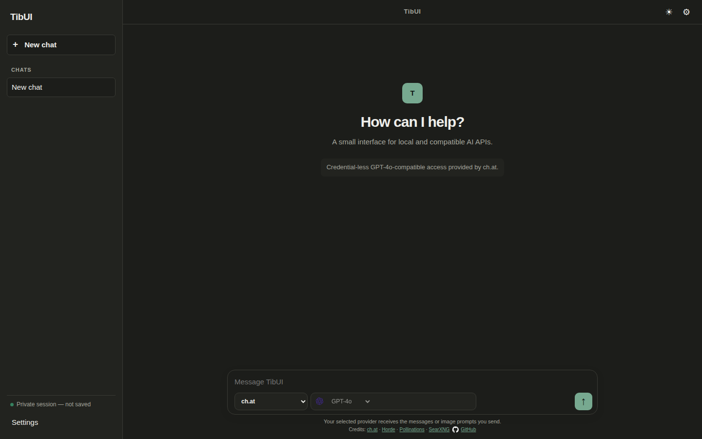
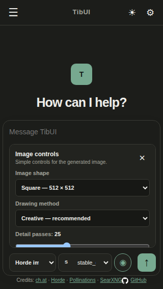

# TibUI

TibUI is a small, self-hostable AI frontend made from static HTML, CSS, and JavaScript. It has no build step, framework, server database, or required account. It is designed to remain usable on iOS 12, older mobile devices, and current browsers.

## Features

- OpenAI-compatible chat APIs
- Credential-less GPT-4o-compatible chat through ch.at
- Pollinations anonymous text models
- Stable Horde / AI Horde text and image generation with live model, worker, queue, and ETA information
- Optional Stable Horde image safety filtering
- Local Ollama model discovery and generation controls
- Optional SearXNG web search using a same-origin relay or a direct browser connection
- Anonymous sessions by default, with opt-in cookie chat storage
- Deletable chat-history entries
- Empty chats are reused instead of filling history with duplicate blank entries
- Dark mode by default with a top-bar light/dark switch and a system-theme option
- Compatibility presets and a maximum-compatibility mode
- Model-company logos stored locally with no logo requests to third parties
- Responsive layouts for 320 px phones, tablets, and desktop displays
- Safe lightweight Markdown rendering for headings, lists, links, quotes, code, tasks, and tables

## Interface

Provider, model, optional tools, and send controls share one compact toolbar below the message box. Web search is disabled by default and uses two separate controls: enable the experimental feature in Settings, then switch on the Web tool for each message that should use search.





## Providers

| Provider                | Credentials                       | Use                                   |
| ----------------------- | --------------------------------- | ------------------------------------- |
| ch.at                   | None                              | GPT-4o-compatible chat                |
| Pollinations            | None for the legacy text endpoint | Selectable free text models           |
| Stable Horde / AI Horde | Anonymous key included            | Community text and image workers      |
| Ollama                  | Normally none                     | Local or self-hosted models           |
| OpenAI-compatible       | Optional API key                  | Any browser-accessible compatible API |

Public, credential-less services can rate-limit requests, change models, or become unavailable. TibUI reports provider errors but cannot guarantee third-party uptime.

## Run locally

TibUI must be served over HTTP rather than opened as a `file:` URL.

```sh
python3 -m http.server 8080
```

Open `http://localhost:8080`.

Any static web server works. Upload `index.html`, `style.css`, `app.js`, and `icons/` together. No compilation is required.

## Privacy and storage

Chat saving is off by default. Without it, chat history exists only in the current page session. When enabled, TibUI stores a size-limited set of recent chats and preferences in a first-party cookie. API keys are kept only in memory and are never written to that cookie.

Messages and image prompts are sent directly from the browser to the selected provider. Web search queries are sent to the configured SearXNG route only when experimental web search is available in Settings and the composer Web tool is active.

## Ollama

The default URL is `http://localhost:11434`. Settings include model discovery, temperature, top-p, context length, seed, and keep-alive.

When TibUI and Ollama use different origins, Ollama must allow the page origin. For example, start Ollama with an origin matching the site:

```sh
OLLAMA_ORIGINS="https://your-tibui.example" ollama serve
```

An HTTPS TibUI page normally cannot call an HTTP Ollama endpoint because browsers block mixed content. Use both services locally over HTTP, expose Ollama securely, or proxy it behind the TibUI origin.

## Web search and local SearXNG

Web search is experimental and off by default. Enable it under **Chat & experimental search** to reveal the Web tool beside the message box. The Web tool remains off until selected, so enabling the feature does not add search data to every request.

SearXNG must have JSON output enabled:

```yaml
search:
  formats:
    - html
    - json
```

A browser-only app cannot bypass any of the following:

- a missing `Access-Control-Allow-Origin` response header
- an HTTP 429 rate limit
- an HTTPS page trying to call an HTTP endpoint
- an invalid certificate on an HTTPS IP address
- browser private-network access restrictions

Changing a private HTTP address to use an `https://` prefix does not fix the connection unless that server actually provides trusted HTTPS.

### Recommended same-origin relay

Set the TibUI search mode to **Same-origin relay** or **Auto**, and use `/searxng` as the relay path. The public-facing web server must forward that path to SearXNG.

Nginx example:

```nginx
location /searxng/ {
    proxy_pass http://searxng:8080/;
    proxy_set_header Host $host;
    proxy_set_header X-Forwarded-For $proxy_add_x_forwarded_for;
    proxy_set_header X-Forwarded-Proto $scheme;
}
```

Caddy example:

```caddyfile
handle_path /searxng/* {
    reverse_proxy searxng:8080
}
```

This makes the browser request `https://your-tibui.example/searxng/search`; the server performs the private HTTP request. It avoids browser CORS, mixed-content, and private-network barriers without exposing SearXNG directly.

GitHub Pages cannot provide a reverse proxy. A GitHub Pages deployment must use a separate HTTPS SearXNG endpoint that permits the site origin, or place the custom domain behind infrastructure that can implement `/searxng`.

### Direct cross-origin access

Direct mode works only when SearXNG is served over acceptable HTTPS and returns an appropriate CORS header. A narrowly scoped example is:

```yaml
server:
  default_http_headers:
    Access-Control-Allow-Origin: https://your-tibui.example
```

Review your SearXNG version's configuration documentation and restrict access appropriately. A wildcard CORS policy may expose a private instance to unwanted public use.

### Public-instance audit

These endpoints were checked on 2026-10-01. Public instance behavior changes, so they are candidates rather than uptime guarantees.

| Endpoint                            | JSON | Browser CORS | Observed result                                                              |
| ----------------------------------- | ---- | ------------ | ---------------------------------------------------------------------------- |
| `https://severian-searxng.hf.space` | Yes  | Yes          | Browser-readable, but its upstream engines often returned no general results |

The public SearXNG directory had no instance that simultaneously demonstrated dependable general results, JSON output, and browser CORS during the audit. Self-hosting with a same-origin relay is the reliable setup.

## Compatibility presets

| Preset                | Behavior                                                                                |
| --------------------- | --------------------------------------------------------------------------------------- |
| Maximum compatibility | Conservative rendering, reduced motion, no effects, slower polling, 12-message requests |
| Balanced              | Effects and live model refresh enabled, 24-message requests                             |
| Fast and minimal      | Reduced motion, no effects or startup model refresh, 8-message requests                 |

Maximum compatibility is enabled by default. Model-company logos can be disabled independently under **Compatibility & performance**.

## Stable Horde models

TibUI reads live text and image model data from the AI Horde status API. Models are ordered by available workers. The model bar shows the selected model's worker count and estimated wait time.

The **Advanced image controls** panel appears next to the message bar whenever Stable Horde images is selected. It uses plain-language labels and touch-friendly sliders for shape, drawing method, detail passes, prompt strength, smoother detail, optional safety filtering, and a repeatable seed. Larger dimensions and more detail passes generally increase queue and generation time.

Long backend identifiers are simplified only for display. For example:

```text
koboldcpp/Meta-Llama-3.1-8B-Instruct-IQ4_NL → Llama 3.1 8B Instruct
```

The original identifier is still sent to the API.

Safety filtering is enabled by default for Stable Horde images. It hides obviously adult-focused model names and asks AI Horde to censor detected adult output. It is an optional best-effort control, not a guarantee.

## Project structure

```text
index.html   Interface and settings
style.css    Responsive light and dark layouts
app.js       Providers, chats, search, and compatibility behavior
icons/       Local model-company and GitHub SVG marks
```

## Credits

- [ch.at](https://ch.at) for credential-less GPT-4o-compatible chat access
- [AI Horde / Stable Horde](https://aihorde.net) for community text and image generation
- [Pollinations.AI](https://pollinations.ai) for the anonymous legacy text API
- [SearXNG](https://docs.searxng.org) for self-hostable metasearch
- [Simple Icons](https://simpleicons.org) for company and GitHub marks
- [TibUI source on GitHub](https://github.com/viirtec/TibUI)
