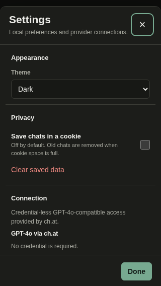

# TibUI

TibUI is a small, self-hostable AI frontend made from static HTML, CSS, and JavaScript. It has no build step, framework, server database, or required account. It is designed to remain usable on old browsers like iOS 12+, other older HTML5 supported mobile devices, and current up to date browsers.

## Features

- OpenAI-compatible chat APIs
- Credential-less GPT-4o-compatible chat through ch.at
- Pollinations anonymous text models
- Stable Horde / AI Horde text and image generation with live model, worker, queue, and ETA information
- Stable Horde image controls in Settings, with optional safety filtering and repeatable seeds
- Optional **Smart tools**, off by default: model-prepared tool queries, lookups, and a final answer using the results
- A + tools menu with on/off switches generated from a modular tool registry, with enabled-tool buttons in the composer
- Optional AI tool selection using conversation context in Settings, off by default
- Live Open-Meteo weather and seven-day forecasts without an API key
- Wikipedia lookup in six languages
- Keyless GitHub repository and issue search, repository filename lookup, and text-file reading
- Experimental text attachments (.txt, .json, .md, .csv, .log, .xml, .yaml, .yml)
- Individual chat export and selective JSON chat import, including images, sources, and attached text
- Keyless Frankfurter currency conversion using the latest daily reference rate
- Crossref research-paper search and DOI metadata lookup, with abstracts and accessible Europe PMC article text
- Copy controls under messages; copy, download, and wrap controls for fenced code blocks
- Local Ollama model discovery and generation controls
- Optional SearXNG web search using a same-origin relay or a direct browser connection
- Anonymous sessions by default, with opt-in cookie chat storage
- Deletable chat-history entries
- Dark mode by default with a top-bar light/dark switch and a system-theme option
- Compatibility presets and a maximum-compatibility mode
- Model-company logos stored locally with no logo requests to third parties
- Responsive layouts for 320 px phones, tablets, and desktop displays, with a compact model selector
- Safe lightweight Markdown rendering for headings, lists, links, quotes, code, tasks, and tables

## Interface

Provider, model, and send controls share one compact toolbar below the message box. Open **+** to switch tools on or off and attach text files. Manually enabled tools stay selected until switched off. The provider and model selectors sit together between equally sized tools and send buttons. Buttons beneath the composer toolbar show enabled tools and open their switches. Automatically selected tools are labeled “auto” for the latest request. Web search first needs to be enabled and configured in Settings; the other tools need no API key.

Turn on **Image generation** to select Stable Horde images. Turning it off returns to the previous text provider. Image settings are always available under **Settings → Image generation**; choosing Horde images directly remains supported. Text lookup tools are unavailable while generating images.




## Providers

| Provider                | Credentials                       | Use                                   |
| ----------------------- | --------------------------------- | ------------------------------------- |
| ch.at                   | None                              | GPT-4o-compatible chat                |
| Pollinations            | None for the legacy text endpoint | Selectable free text models           |
| Stable Horde / AI Horde | Anonymous key included            | Community text and image workers      |
| Ollama                  | Normally none                     | Local or self-hosted models           |
| OpenAI-compatible       | Optional API key                  | Any browser-accessible compatible API |

Public, credential-less services can rate-limit requests, change models, or become unavailable. TibUI reports provider errors but cannot guarantee third-party uptime.

## Run locally

TibUI must be served over HTTP rather than opened as a `file:` URL.

```sh
python3 -m http.server 8080
```

Open `http://localhost:8080`.

Any static web server works. Upload `index.html`, `style.css`, `app.js`, `chat-files.js`, `code-controls.js`, `tools/`, and `icons/` together. No compilation is required.

## Privacy and storage

Chat saving is off by default. Without it, chat history exists only in the current page session. When enabled, TibUI stores a size-limited set of recent chats and preferences in a first-party cookie. API keys are kept only in memory and are never written to that cookie.

Messages and image prompts are sent directly from the browser to the selected provider. Web search queries are sent to the configured SearXNG route only when experimental web search is available in Settings and Web search is switched on in the + menu. Weather, Wikipedia, and GitHub queries go directly to their respective public APIs when selected. Attached text is sent to the selected provider with the message and retained in that chat for follow-up requests.

## Ollama

The default URL is `http://localhost:11434`. Settings include model discovery, temperature, top-p, context length, seed, and keep-alive.

When TibUI and Ollama use different origins, Ollama must allow the page origin. For example, start Ollama with an origin matching the site:

```sh
OLLAMA_ORIGINS="https://your-tibui.example" ollama serve
```

An HTTPS TibUI page normally cannot call an HTTP Ollama endpoint because browsers block mixed content. Use both services locally over HTTP, expose Ollama securely, or proxy it behind the TibUI origin.

## Web search and local SearXNG

Web search is experimental and off by default. Enable it under **Chat & experimental search** to make Web search available in the + menu. The Web tool remains off until selected, so enabling the feature does not add search data to every request.

SearXNG must have JSON output enabled:

```yaml
search:
  formats:
    - html
    - json
```

A browser-only app cannot bypass any of the following:

- a missing `Access-Control-Allow-Origin` response header
- an HTTP 429 rate limit
- an HTTPS page trying to call an HTTP endpoint
- an invalid certificate on an HTTPS IP address
- browser private-network access restrictions

Changing a private HTTP address to use an `https://` prefix does not fix the connection unless that server actually provides trusted HTTPS.

### Recommended same-origin relay

Set the TibUI search mode to **Same-origin relay** or **Auto**, and use `/searxng` as the relay path. The public-facing web server must forward that path to SearXNG.

Nginx example:

```nginx
location /searxng/ {
    proxy_pass http://searxng:8080/;
    proxy_set_header Host $host;
    proxy_set_header X-Forwarded-For $proxy_add_x_forwarded_for;
    proxy_set_header X-Forwarded-Proto $scheme;
}
```

Caddy example:

```caddyfile
handle_path /searxng/* {
    reverse_proxy searxng:8080
}
```

This makes the browser request `https://your-tibui.example/searxng/search`; the server performs the private HTTP request. It avoids browser CORS, mixed-content, and private-network barriers without exposing SearXNG directly.

GitHub Pages cannot provide a reverse proxy. A GitHub Pages deployment must use a separate HTTPS SearXNG endpoint that permits the site origin, or place the custom domain behind infrastructure that can implement `/searxng`.

### Direct cross-origin access

Direct mode works only when SearXNG is served over acceptable HTTPS and returns an appropriate CORS header. A narrowly scoped example is:

```yaml
server:
  default_http_headers:
    Access-Control-Allow-Origin: https://your-tibui.example
```

Review your SearXNG version's configuration documentation and restrict access appropriately. A wildcard CORS policy may expose a private instance to unwanted public use.

### Public-instance audit

These endpoints were checked on 2026-10-01. Public instance behavior changes, so they are candidates rather than uptime guarantees.

| Endpoint                            | JSON | Browser CORS | Observed result                                                              |
| ----------------------------------- | ---- | ------------ | ---------------------------------------------------------------------------- |
| `https://severian-searxng.hf.space` | Yes  | Yes          | Browser-readable, but its upstream engines often returned no general results |

The public SearXNG directory had no instance that simultaneously demonstrated dependable general results, JSON output, and browser CORS during the audit. Self-hosting with a same-origin relay is the reliable setup.

## Compatibility presets

| Preset                | Behavior                                                                                |
| --------------------- | --------------------------------------------------------------------------------------- |
| Maximum compatibility | Conservative rendering, reduced motion, no effects, slower polling, 12-message requests |
| Balanced              | Effects and live model refresh enabled, 24-message requests                             |
| Fast and minimal      | Reduced motion, no effects or startup model refresh, 8-message requests                 |

Maximum compatibility is enabled by default. Model-company logos can be disabled independently under **Compatibility & performance**.

## Stable Horde models

TibUI reads live text and image model data from the AI Horde status API. Models are ordered by available workers. Worker count, queue count, and estimated wait time appear in a separate row beneath the compact model selector so that the information stays visible on desktop and mobile. Refresh the model list to update these figures.

The **Image generation** section in Settings configures Stable Horde image requests, regardless of which provider is currently selected. It uses plain-language labels and touch-friendly sliders for shape, drawing method, detail passes, prompt strength, smoother detail, optional safety filtering, and a repeatable seed. Larger dimensions and more detail passes generally increase queue and generation time.

Long backend identifiers are simplified only for display. For example:

```text
koboldcpp/Meta-Llama-3.1-8B-Instruct-IQ4_NL → Llama 3.1 8B Instruct
```

The original identifier is still sent to the API.

Safety filtering is enabled by default for Stable Horde images. It hides obviously adult-focused model names and asks AI Horde to censor detected adult output. It is an optional best-effort control, not a guarantee.

## Weather, Wikipedia, and GitHub tools

Enable **Weather** in the + menu, then ask `weather Tallinn`, `weather in Tallinn tomorrow`, `weather tomorrow Tallinn`, `will it rain in Tallinn?`, or enter a city name. TibUI resolves the city using Open-Meteo geocoding and sends current conditions and a seven-day forecast to the selected text model. If a location cannot be resolved, it reports the lookup error rather than asking the model to invent live weather. City names should be specific; geocoding currently selects the first matching location. No device location permission is used.

**Wikipedia** searches for the message text and adds article extracts and source links. Language and result count are configurable in Settings.

**GitHub** uses the public REST API without a token:

- `github repos lightweight chat language:javascript` searches public repositories.
- `github issues repo:owner/repo bug` searches issues and pull requests.
- `github code owner/repo filename` or `github files owner/repo filename` searches paths within a repository's default branch, with up to 20 results.
- `github file owner/repo path/to/file.js` reads a text file under 100 KB, adding up to 16,000 characters to model context.

[GitHub global code-content search requires authentication](https://docs.github.com/en/rest/search/search#search-code), so the keyless tool offers repository filename lookup and explicit file reading instead. [Unauthenticated API requests have IP-based rate limits](https://docs.github.com/en/rest/using-the-rest-api/rate-limits-for-the-rest-api); filename lookup can be incomplete when GitHub truncates a large repository tree. Optional lookup failures are reported while chat continues. Disable unrelated tools when you only want one kind of lookup.

## Currency conversion and research

Enable **Currency** and ask `convert 100 EUR to USD` or `25 GBP in EUR`. Currency codes are case-insensitive; amounts support decimals and comma thousands separators. TibUI fetches the latest available rate from the [keyless Frankfurter v2 API](https://frankfurter.dev/), calculates the amount locally, and sends the result, rate, and publication date to the model. Frankfurter provides daily reference rates rather than live intraday trading quotes; the tool does not claim second-by-second prices. Unsupported pairs and malformed conversions report errors instead of asking the model to invent a rate.

Enable **Research** and ask `research papers quantum computing`, or enter `DOI metadata 10.1038/nphys1170`. The [keyless Crossref REST API](https://www.crossref.org/documentation/retrieve-metadata/rest-api/) supplies up to five metadata matches, or one record for an exact DOI, with title, authors, publication date, publication name, publisher, and DOI links. TibUI includes Crossref abstracts when supplied and looks up matching DOIs in [Europe PMC](https://europepmc.org/RestfulWebService). It reads openly available article XML there and extracts section headings and paragraphs so the model can discuss findings, methods, and limitations from the text. Each paper is labeled **Metadata only**, **Abstract only**, or **Article body excerpt**, with readable-paper source links when available. Inaccessible papers retain whatever abstract or metadata is available; the model is instructed to distinguish that evidence from text it actually received.

For performance on older devices, each request returns up to five Crossref records, checks the first three in Europe PMC, and attempts full-text reading for the first two. Each XML download is limited to 2 MB and 20 seconds; Europe PMC metadata lookups have a 15-second timeout. Abstracts are limited to 5,000 characters. Article bodies longer than 24,000 characters contribute their first 16,000 and last 8,000 characters, with an explicit omission marker. Figures, tables, references, and supplements are not represented as full document contents. Europe PMC focuses on life-sciences literature, so many other papers may have only a Crossref abstract or metadata. TibUI does not bypass paywalls or parse PDF files.

For example, `read paper DOI 10.1093/nar/gku1061` adds the accessible article body to the model request. Enable Research manually or use automatic selection. Paper text goes directly to the selected model along with the prompt.

## Automatic tool selection

Under **Settings → Chat & experimental search**, turn on **Automatic tool selection** if desired. It is off by default. The selected model receives recent conversation messages and the available tool catalog, then selects useful tools and prepares their input in one JSON planning request. There is no English keyword gate: Estonian questions, paraphrases and follow-ups are interpreted by the model. For example, after discussing Shiba Inu dogs, `How big are they?` can become a Wikipedia search for Shiba Inu height and weight.

Automatic selection includes Smart tools automatically; its separate checkbox is disabled while automatic selection is on and restores its saved preference when automatic selection is turned off. Manual selections continue to apply. Optional automatic tools are limited to three per message and are shown with an “auto” chip rather than saved as manual switches. Greetings and requests that do not benefit from lookup can skip tools. Automatically selected tools appear as checked switches. Turn one off to clear its current selection. It remains available for the AI to select again on a later message when useful; switching it on explicitly enables it manually. Switching, starting or deleting chats clears automatic selections, and automatic image selection restores the previous text provider. Manually selected tools retain their existing behavior.

Only available tools appear in the catalog. Web search still requires its Settings availability switch and connection configuration. Text lookup tools are unavailable while generating images. An explicit image request can switch to Horde images after planning, retaining image settings, without cancelling the active request. Turning image generation off returns to the previous text provider.

## Code blocks

Fenced code blocks (backticks or tildes), including an unfinished final fence, have **Copy**, **Download**, and **Wrap** buttons. Copy uses the browser clipboard or the older `execCommand` path. Download saves the exact code text with an extension based on the language; unknown languages use `.txt`. Wrap changes display only. The original code remains unchanged for copying and downloading. On older Safari, a download can open in another tab for saving through browser controls.

## Text attachments and chat transfer

Use **+ → Attach text files (experimental)** to select up to five files totaling 100 KB. Click a file chip to remove it before sending. Text is read with FileReader; TibUI does not upload files to a storage service. Attached text is included with the next message and preserved in conversation context and chat exports. For image generation it is appended to the image prompt. Binary files and larger documents are unsupported.

Under **Settings → Privacy**, **Export chats** downloads all current chats as `tibui-chats.json`; **Export current chat** downloads the active conversation as `tibui-chat.json`. **Import chats** validates either format and presents a checkbox list. Choose one or more chats and click **Import selected chats** to add only those conversations with new IDs, retaining existing chats. Cancel leaves the history untouched. Imports support version 1 exports, files under 10 MB, up to 200 chats and 20,000 messages. Malformed imports leave existing chats untouched. Exported JSON contains conversation contents and attached text, but no API keys or provider settings.

Safari versions without download-attribute support may open the JSON instead; save the opened file using the browser's sharing or save controls. Import does not enable cookie storage. Large histories are best preserved using exports because cookie saving remains size-limited. Exported image URLs can expire at the provider; export does not download remote image bytes.

## Smart tools

Enable **Settings → Chat & experimental search → Smart tools** to expand manual lookups with up to three focused queries per search tool. It is off by default. Basic input preparation for manually selected tools always uses the conversation, even with Smart tools off, so follow-up questions and natural phrasing can become valid tool inputs. Automatic selection includes Smart tools in its shared planning step.

The planner receives recent user and assistant messages up to the configured history limit, bounded to 24 messages and 32,000 characters. Tool context is supplied with the latest user message for the final answer, rather than attached to earlier questions. Messages remain in the active chat without requiring cookies; opt-in storage and JSON export/import still control persistence across sessions. Starting a new chat starts new conversation context.

Weather and currency use one canonical input. Currency input validation preserves the amount and codes when the user supplied an explicit currency pair. GitHub prepares repository, issue, filename or file-reading queries from natural phrasing. Research preserves DOIs and extracts available paper text. Wikipedia searches use its configured language. For example, an Estonian Wikipedia question such as `millal oli eestis laulev revolutsioon` can produce `laulev revolutsioon`, `eesti`, and `eesti iseseisvuse taastamine`. Tool results become reference context for an answer to the original question, with source links.

The planner retries an invalid or incomplete plan once with feedback. A tool that returns no useful results or fails gets one query-repair step and a bounded lookup retry. Remaining required failures stop the request; optional failures appear as status warnings. If planning remains unavailable, manually selected tools try the original request; automatic selection reports the failure rather than silently reverting to English keyword matching. No planning attempt is stored as a chat message. Cancellation stops planning, repair and lookups.

Image generation uses the previous text provider to refine the image prompt before submitting it to Stable Horde. Planning and retries add model requests, latency and potential provider usage or queue time. Plans accept bounded strings for listed tools only; the model cannot supply arbitrary endpoints or executable code. New context tools participate through `run(query, cancelled)`; `planningHint` describes accepted input, and optional `validateQuery(query, original)` rejects invalid plans before execution.

## Adding tools

Runtime code uses classic scripts, ES5 syntax, XMLHttpRequest, FileReader, and Promises supported by iOS 12 WebKit. It does not require modules, fetch, async functions, optional chaining, or a JavaScript framework. The browser cannot enumerate a static hosting directory, so a small Python script discovers all tool `.js` files and writes the checked-in loader manifest:

```sh
python3 - <<'PYTOOLS'
import json
from pathlib import Path
files = sorted(p.name for p in Path("tools").glob("*.js")
               if p.name not in ("registry.js", "manifest.js"))
Path("tools/manifest.js").write_text(
    "window.TibUIToolFiles = " + json.dumps(files, indent=2) + ";\n")
PYTOOLS
```

The ignored local helper `scripts/discover-tools.py` performs the same discovery on the development machine. It is not required to serve the site.

Add a file under `tools/`, register it, and regenerate the manifest. No changes to `app.js` or `index.html` are needed. Files load sequentially; registry and manifest files are excluded from discovery. Register a uniquely named tool using this contract:

```js
(function (window) {
  "use strict";
  var options;
  window.TibUITools.register("example", {
    name: "Example",
    planningHint: "Return concise topic keywords accepted by this search API.",
    activeKey: "exampleToolActive",
    contextTool: true,
    init: function (context) {
      options = context;
    },
    isActive: function () {
      return (
        options.state.exampleToolActive &&
        options.state.provider !== "hordeImage"
      );
    },
    run: function (prompt) {
      return options.requestJson(
        "GET",
        "https://your-api.example/search?q=" + encodeURIComponent(prompt),
        null,
        null
      );
    },
    formatContext: function (data) {
      return String(data.text || "");
    }
  });
})(window);
```

`planningHint` is optional tool-local guidance for Smart tools; without it the registry asks for concise search keywords. The AI selects available tools using their name and guidance, without a keyword matcher. The shared planner returns `{ "tools": { "example": { "queries": ["topic keywords"] } } }`, validates and deduplicates queries, and executes each through `run(query, cancelled)` without changes to `app.js`. Mark a tool `required: true` when it needs one exact operation and failure must stop the request. `generationTool: true` tools receive one refined generation prompt.

`run` returns a Promise; optional `results` rows contain `title`, `url`, and `content` for source display. Optional `shouldRun(prompt)` filters execution, `enabledKey` connects a Settings availability preference, `required` makes a lookup failure stop the request, and `setActive(value)` handles special switches such as image generation. Shared helpers include state, DOM lookup, request handling, and saving. An optional `validateQuery(query, original)` validates prepared inputs. Tool context is untrusted reference material and should be labeled accordingly. Keep tool code and APIs compatible with older Safari.

## Project structure

```text
index.html                 Interface and settings
style.css                  Responsive light and dark layouts
app.js                     Providers, chats, and compatibility behavior
chat-files.js              Text attachments and selective JSON chat transfer
code-controls.js           Copy, download, and wrap for code blocks
tools/registry.js          Generic loader, switches, and execution pipeline
tools/manifest.js          Discovered tool filenames
tools/*.js                 Self-registering tools
icons/                     Local model-company and GitHub SVG marks
screenshots/               Tracked README illustrations
.gitignore                 Excludes local development and testing files
```

## Modifying and reusing TibUI code

- When modifying, rebranding, or using code from TibUI, you MUST give credit to [ViirTec](https://viirtec.eu/) and have clearly visible and easily discoverable link to [TibUI GitHub repository](https://github.com/viirtec/TibUI) with the title "This project uses code from ViirTec's TibUI"

- You are only allowed to use code from TibUI for commercial or non-commercial projects and products if you cite and give credit to TibUI and ViirTec as mentioned above.

- All projects that use code from TibUI must be published and served under the **GNU General Public License v3.0** license and must follow the terms and conditions of the license

## Credits

- [ch.at](https://ch.at) for credential-less GPT-4o-compatible chat access
- [AI Horde / Stable Horde](https://aihorde.net) for community text and image generation
- [Pollinations.AI](https://pollinations.ai) for the anonymous legacy text API
- [SearXNG](https://docs.searxng.org) for self-hostable metasearch
- [Open-Meteo](https://open-meteo.com) for keyless weather and geocoding
- [Wikipedia](https://www.wikipedia.org) for article lookup
- [GitHub REST API](https://docs.github.com/en/rest) for public repository lookup
- [Frankfurter](https://frankfurter.dev) for daily reference exchange rates
- [Crossref](https://www.crossref.org) for scholarly metadata and DOI lookup
- [Europe PMC](https://europepmc.org) for accessible abstracts and open-access article text
- [Simple Icons](https://simpleicons.org) for company and GitHub marks
- [TibUI source on GitHub](https://github.com/viirtec/TibUI)
